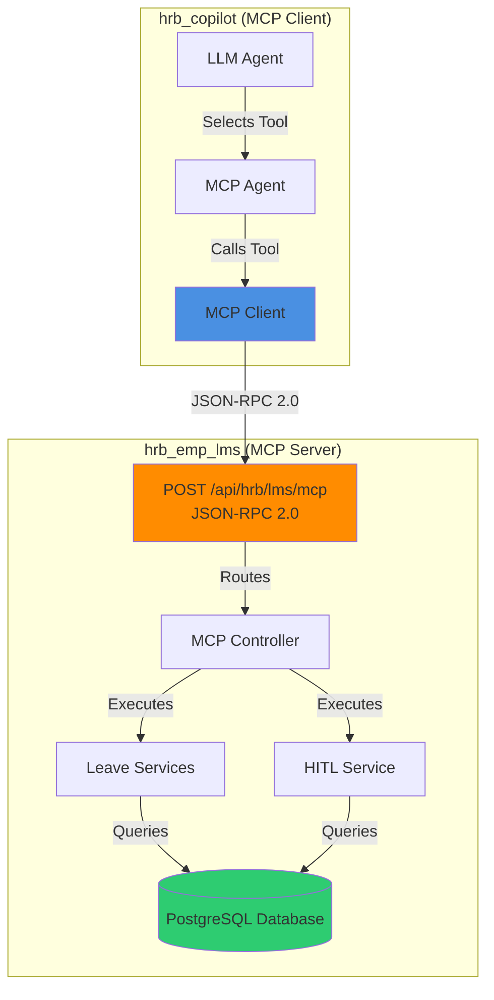
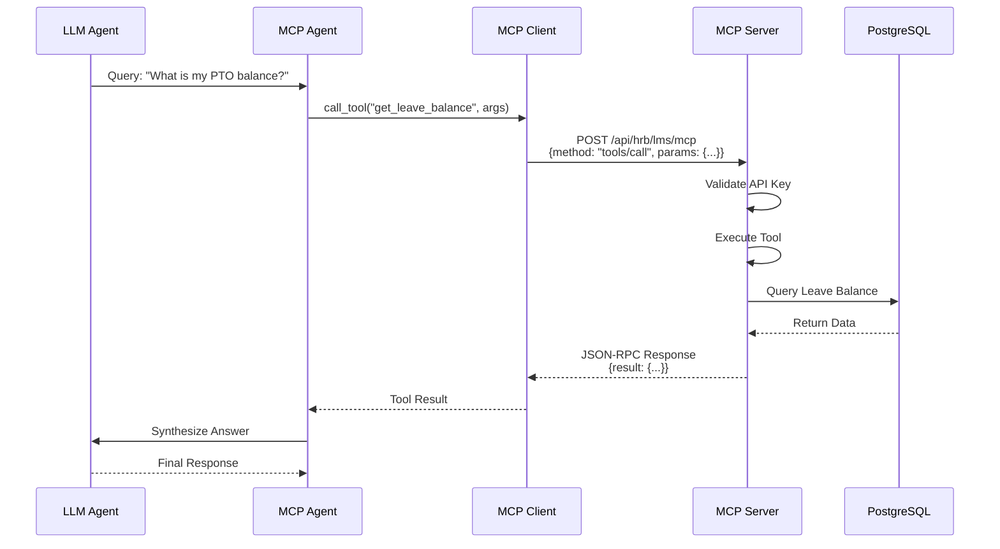
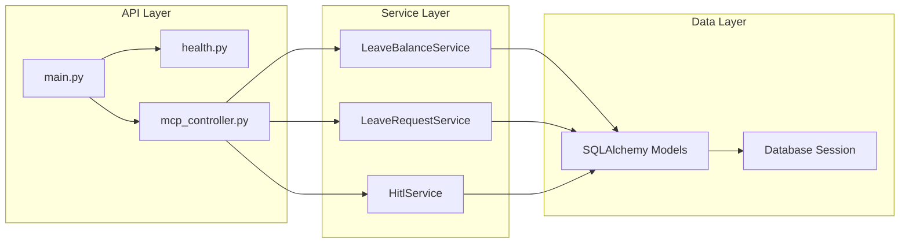
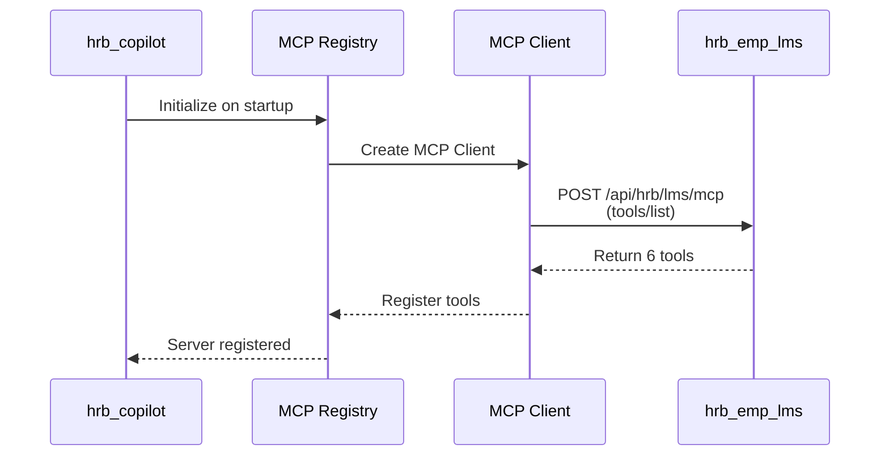

# HRB Employee LMS MCP Server Documentation

## Table of Contents

1. [Overview](#overview)
2. [Architecture](#architecture)
3. [MCP Protocol](#mcp-protocol)
4. [Database Schema](#database-schema)
5. [MCP Tools](#mcp-tools)
6. [API Endpoints](#api-endpoints)
7. [Request/Response Payloads](#requestresponse-payloads)
8. [Configuration](#configuration)
9. [Setup & Installation](#setup--installation)
10. [Testing](#testing)
11. [Integration](#integration)

---

## Overview

**HRB Employee LMS MCP Server** is a Python-based Model Context Protocol (MCP) server that provides leave management system functionality through standardized MCP tools. It exposes exactly **one MCP Protocol endpoint** that speaks **JSON-RPC 2.0**, enabling LLM-powered chatbots to interact with leave management operations.

### Key Features

- ✅ **MCP Protocol Compliant**: Single JSON-RPC 2.0 endpoint (`POST /api/hrb/lms/mcp`)
- ✅ **6 MCP Tools**: Leave balance, leave requests, approvals, and HITL operations
- ✅ **PostgreSQL Database**: Robust data persistence
- ✅ **X-API-Key Authentication**: Secure API access
- ✅ **No REST API Exposure**: Only MCP Protocol endpoint (as per design requirements)
- ✅ **Comprehensive Logging**: Colored console logs with structured information

### Technology Stack

- **Framework**: FastAPI (Python 3.9+)
- **Database**: PostgreSQL with SQLAlchemy ORM
- **Protocol**: JSON-RPC 2.0 (MCP Protocol)
- **Authentication**: X-API-Key header
- **Logging**: Enhanced colored logging with bracket-based colorization

---

## Architecture

### System Architecture Diagram



### MCP Protocol Flow



### Component Architecture



---

## MCP Protocol

### Endpoint

**Single MCP Protocol Endpoint:**
```
POST /api/hrb/lms/mcp
```

### Authentication

All requests must include the `X-API-Key` header:
```
X-API-Key: <your-api-key>
```

### JSON-RPC 2.0 Methods

The MCP server supports two JSON-RPC 2.0 methods:

#### 1. `tools/list`

Lists all available MCP tools with their schemas.

**Request:**
```json
{
  "jsonrpc": "2.0",
  "id": "list_tools_001",
  "method": "tools/list",
  "params": null
}
```

**Response:**
```json
{
  "jsonrpc": "2.0",
  "id": "list_tools_001",
  "result": {
    "tools": [
      {
        "name": "get_leave_balance",
        "description": "Get leave balance for an employee",
        "inputSchema": {
          "type": "object",
          "properties": {
            "employee_id": {"type": "string", "description": "Employee ID"},
            "year": {"type": "integer", "description": "Year (optional, defaults to current year)"}
          },
          "required": ["employee_id"]
        }
      },
      // ... other tools
    ]
  }
}
```

#### 2. `tools/call`

Executes a named MCP tool with provided arguments.

**Request:**
```json
{
  "jsonrpc": "2.0",
  "id": "call_tool_001",
  "method": "tools/call",
  "params": {
    "name": "get_leave_balance",
    "arguments": {
      "employee_id": "EMP001",
      "year": 2025
    }
  }
}
```

**Response (Success):**
```json
{
  "jsonrpc": "2.0",
  "id": "call_tool_001",
  "result": {
    "employee_id": "EMP001",
    "year": 2025,
    "balances": [
      {
        "leave_type": "PTO",
        "accrued": 20.0,
        "used": 5.0,
        "available": 15.0
      }
    ]
  }
}
```

**Response (Error):**
```json
{
  "jsonrpc": "2.0",
  "id": "call_tool_001",
  "error": {
    "code": -32603,
    "message": "Internal error",
    "data": {
      "error": "Employee not found: EMP001",
      "status": "error"
    }
  }
}
```

---

## Database Schema

### Entity Relationship Diagram

```mermaid
erDiagram
    EMPLOYEES ||--o{ LEAVE_BALANCES : has
    EMPLOYEES ||--o{ LEAVE_REQUESTS : submits
    EMPLOYEES ||--o{ HITL_REQUESTS : creates
    EMPLOYEES ||--o| EMPLOYEES : manages
    LEAVE_TYPES ||--o{ LEAVE_BALANCES : used_in
    LEAVE_TYPES ||--o{ LEAVE_REQUESTS : used_in
    
    EMPLOYEES {
        int id PK
        string employee_id UK
        string name
        string email UK
        string department
        int manager_id FK
        date hire_date
        enum employment_type
        datetime created_at
        datetime updated_at
    }
    
    LEAVE_TYPES {
        int id PK
        string code UK
        string name
        decimal accrual_rate
        int max_carryover
        boolean requires_approval
        datetime created_at
    }
    
    LEAVE_BALANCES {
        int id PK
        int employee_id FK
        int leave_type_id FK
        decimal accrued
        decimal used
        decimal available COMPUTED
        int year
        datetime created_at
        datetime updated_at
    }
    
    LEAVE_REQUESTS {
        int id PK
        int employee_id FK
        int leave_type_id FK
        date start_date
        date end_date
        decimal days
        text reason
        enum status
        int approver_id FK
        datetime approved_at
        text rejection_reason
        datetime created_at
        datetime updated_at
    }
    
    HITL_REQUESTS {
        int id PK
        string request_type
        string related_entity_type
        int related_entity_id
        int employee_id FK
        text query
        json context
        enum status
        string assigned_to
        text response
        datetime responded_at
        datetime created_at
        datetime updated_at
    }
```

### Table Definitions

#### `employees`

| Column | Type | Constraints | Description |
|--------|------|-------------|-------------|
| `id` | INTEGER | PRIMARY KEY | Auto-increment ID |
| `employee_id` | VARCHAR(50) | UNIQUE, NOT NULL, INDEX | Employee identifier |
| `name` | VARCHAR(255) | NOT NULL | Employee name |
| `email` | VARCHAR(255) | UNIQUE, NOT NULL | Email address |
| `department` | VARCHAR(100) | | Department name |
| `manager_id` | INTEGER | FOREIGN KEY | Manager's employee ID |
| `hire_date` | DATE | | Hire date |
| `employment_type` | ENUM | | FULL_TIME, PART_TIME, CONTRACTOR |
| `created_at` | TIMESTAMP | DEFAULT NOW() | Creation timestamp |
| `updated_at` | TIMESTAMP | DEFAULT NOW() | Last update timestamp |

#### `leave_types`

| Column | Type | Constraints | Description |
|--------|------|-------------|-------------|
| `id` | INTEGER | PRIMARY KEY | Auto-increment ID |
| `code` | VARCHAR(50) | UNIQUE, NOT NULL | Leave type code (e.g., "PTO", "SICK") |
| `name` | VARCHAR(255) | NOT NULL | Leave type name |
| `accrual_rate` | NUMERIC(5,2) | | Accrual rate per pay period |
| `max_carryover` | INTEGER | | Maximum carryover days |
| `requires_approval` | BOOLEAN | DEFAULT TRUE | Whether approval is required |
| `created_at` | TIMESTAMP | DEFAULT NOW() | Creation timestamp |

#### `leave_balances`

| Column | Type | Constraints | Description |
|--------|------|-------------|-------------|
| `id` | INTEGER | PRIMARY KEY | Auto-increment ID |
| `employee_id` | INTEGER | FOREIGN KEY, NOT NULL | Employee ID |
| `leave_type_id` | INTEGER | FOREIGN KEY, NOT NULL | Leave type ID |
| `accrued` | NUMERIC(5,2) | DEFAULT 0 | Accrued days |
| `used` | NUMERIC(5,2) | DEFAULT 0 | Used days |
| `available` | NUMERIC(5,2) | COMPUTED | Available days (accrued - used) |
| `year` | INTEGER | NOT NULL | Year |
| `created_at` | TIMESTAMP | DEFAULT NOW() | Creation timestamp |
| `updated_at` | TIMESTAMP | DEFAULT NOW() | Last update timestamp |

#### `leave_requests`

| Column | Type | Constraints | Description |
|--------|------|-------------|-------------|
| `id` | INTEGER | PRIMARY KEY | Auto-increment ID |
| `employee_id` | INTEGER | FOREIGN KEY, NOT NULL | Employee ID |
| `leave_type_id` | INTEGER | FOREIGN KEY, NOT NULL | Leave type ID |
| `start_date` | DATE | NOT NULL | Start date |
| `end_date` | DATE | NOT NULL | End date (must be >= start_date) |
| `days` | NUMERIC(5,2) | NOT NULL | Number of days |
| `reason` | TEXT | | Reason for leave |
| `status` | ENUM | DEFAULT PENDING | PENDING, APPROVED, REJECTED, CANCELLED, PENDING_HITL |
| `approver_id` | INTEGER | FOREIGN KEY | Approver's employee ID |
| `approved_at` | TIMESTAMP | | Approval timestamp |
| `rejection_reason` | TEXT | | Rejection reason |
| `created_at` | TIMESTAMP | DEFAULT NOW() | Creation timestamp |
| `updated_at` | TIMESTAMP | DEFAULT NOW() | Last update timestamp |

#### `hitl_requests`

| Column | Type | Constraints | Description |
|--------|------|-------------|-------------|
| `id` | INTEGER | PRIMARY KEY | Auto-increment ID |
| `request_type` | VARCHAR(50) | NOT NULL | Request type |
| `related_entity_type` | VARCHAR(50) | | Related entity type |
| `related_entity_id` | INTEGER | | Related entity ID |
| `employee_id` | INTEGER | FOREIGN KEY | Employee ID |
| `query` | TEXT | NOT NULL | Query or request description |
| `context` | JSON | | Additional context |
| `status` | ENUM | DEFAULT PENDING | PENDING, IN_PROGRESS, COMPLETED, CANCELLED |
| `assigned_to` | VARCHAR(255) | | Assigned user |
| `response` | TEXT | | Response text |
| `responded_at` | TIMESTAMP | | Response timestamp |
| `created_at` | TIMESTAMP | DEFAULT NOW() | Creation timestamp |
| `updated_at` | TIMESTAMP | DEFAULT NOW() | Last update timestamp |

---

## MCP Tools

The server exposes **6 MCP tools** for leave management operations:

### 1. `get_leave_balance`

Get leave balance for an employee.

**Parameters:**
- `employee_id` (string, required): Employee ID
- `year` (integer, optional): Year (defaults to current year)

**Example Request:**
```json
{
  "jsonrpc": "2.0",
  "id": "1",
  "method": "tools/call",
  "params": {
    "name": "get_leave_balance",
    "arguments": {
      "employee_id": "EMP001",
      "year": 2025
    }
  }
}
```

**Example Response:**
```json
{
  "jsonrpc": "2.0",
  "id": "1",
  "result": {
    "employee_id": "EMP001",
    "year": 2025,
    "balances": [
      {
        "leave_type": "PTO",
        "accrued": 20.0,
        "used": 5.0,
        "available": 15.0
      },
      {
        "leave_type": "SICK",
        "accrued": 10.0,
        "used": 2.0,
        "available": 8.0
      }
    ]
  }
}
```

### 2. `submit_leave_request`

Submit a leave request.

**Parameters:**
- `employee_id` (string, required): Employee ID
- `leave_type` (string, required): Leave type code (e.g., "PTO", "SICK")
- `start_date` (string, required): Start date (YYYY-MM-DD)
- `end_date` (string, required): End date (YYYY-MM-DD)
- `reason` (string, optional): Reason for leave

**Example Request:**
```json
{
  "jsonrpc": "2.0",
  "id": "2",
  "method": "tools/call",
  "params": {
    "name": "submit_leave_request",
    "arguments": {
      "employee_id": "EMP001",
      "leave_type": "PTO",
      "start_date": "2025-02-01",
      "end_date": "2025-02-05",
      "reason": "Family vacation"
    }
  }
}
```

**Example Response:**
```json
{
  "jsonrpc": "2.0",
  "id": "2",
  "result": {
    "request_id": 123,
    "employee_id": "EMP001",
    "leave_type": "PTO",
    "start_date": "2025-02-01",
    "end_date": "2025-02-05",
    "days": 5.0,
    "status": "PENDING",
    "message": "Leave request submitted successfully"
  }
}
```

### 3. `get_leave_history`

Get leave request history for an employee.

**Parameters:**
- `employee_id` (string, required): Employee ID
- `status` (string, optional): Filter by status (PENDING, APPROVED, REJECTED, etc.)
- `limit` (integer, optional): Maximum number of results
- `offset` (integer, optional): Offset for pagination

**Example Request:**
```json
{
  "jsonrpc": "2.0",
  "id": "3",
  "method": "tools/call",
  "params": {
    "name": "get_leave_history",
    "arguments": {
      "employee_id": "EMP001",
      "status": "APPROVED",
      "limit": 10
    }
  }
}
```

**Example Response:**
```json
{
  "jsonrpc": "2.0",
  "id": "3",
  "result": {
    "employee_id": "EMP001",
    "requests": [
      {
        "request_id": 120,
        "leave_type": "PTO",
        "start_date": "2025-01-15",
        "end_date": "2025-01-17",
        "days": 3.0,
        "status": "APPROVED",
        "approved_at": "2025-01-10T10:30:00Z"
      }
    ],
    "total": 1
  }
}
```

### 4. `get_pending_approvals`

Get pending leave approvals for a manager.

**Parameters:**
- `manager_id` (string, required): Manager employee ID

**Example Request:**
```json
{
  "jsonrpc": "2.0",
  "id": "4",
  "method": "tools/call",
  "params": {
    "name": "get_pending_approvals",
    "arguments": {
      "manager_id": "MGR001"
    }
  }
}
```

**Example Response:**
```json
{
  "jsonrpc": "2.0",
  "id": "4",
  "result": {
    "manager_id": "MGR001",
    "pending_requests": [
      {
        "request_id": 123,
        "employee_id": "EMP001",
        "employee_name": "John Doe",
        "leave_type": "PTO",
        "start_date": "2025-02-01",
        "end_date": "2025-02-05",
        "days": 5.0,
        "reason": "Family vacation"
      }
    ],
    "total": 1
  }
}
```

### 5. `create_hitl_request`

Create a Human-in-the-Loop (HITL) request.

**Parameters:**
- `request_type` (string, required): Request type (e.g., "LEAVE_EXCEPTION", "POLICY_INTERPRETATION")
- `query` (string, required): Query or request description
- `related_entity_type` (string, optional): Related entity type
- `related_entity_id` (integer, optional): Related entity ID
- `employee_id` (string, optional): Employee ID
- `context` (object, optional): Additional context
- `priority` (string, optional): Priority (LOW, MEDIUM, HIGH)

**Example Request:**
```json
{
  "jsonrpc": "2.0",
  "id": "5",
  "method": "tools/call",
  "params": {
    "name": "create_hitl_request",
    "arguments": {
      "request_type": "LEAVE_EXCEPTION",
      "query": "Request exception for additional PTO days",
      "employee_id": "EMP001",
      "related_entity_type": "leave_request",
      "related_entity_id": 123,
      "context": {
        "reason": "Medical emergency"
      },
      "priority": "HIGH"
    }
  }
}
```

**Example Response:**
```json
{
  "jsonrpc": "2.0",
  "id": "5",
  "result": {
    "hitl_request_id": 45,
    "request_type": "LEAVE_EXCEPTION",
    "status": "PENDING",
    "query": "Request exception for additional PTO days",
    "created_at": "2025-01-30T14:20:00Z",
    "message": "HITL request created successfully"
  }
}
```

### 6. `get_hitl_status`

Get HITL request status.

**Parameters:**
- `hitl_request_id` (integer, required): HITL request ID

**Example Request:**
```json
{
  "jsonrpc": "2.0",
  "id": "6",
  "method": "tools/call",
  "params": {
    "name": "get_hitl_status",
    "arguments": {
      "hitl_request_id": 45
    }
  }
}
```

**Example Response:**
```json
{
  "jsonrpc": "2.0",
  "id": "6",
  "result": {
    "hitl_request_id": 45,
    "request_type": "LEAVE_EXCEPTION",
    "status": "IN_PROGRESS",
    "query": "Request exception for additional PTO days",
    "assigned_to": "admin@company.com",
    "response": null,
    "created_at": "2025-01-30T14:20:00Z",
    "updated_at": "2025-01-30T15:30:00Z"
  }
}
```

---

## API Endpoints

### MCP Protocol Endpoint

#### `POST /api/hrb/lms/mcp`

The single MCP Protocol endpoint that handles all MCP tool operations.

**Headers:**
```
Content-Type: application/json
X-API-Key: <your-api-key>
```

**Request Body:**
```json
{
  "jsonrpc": "2.0",
  "id": "unique-request-id",
  "method": "tools/list" | "tools/call",
  "params": {
    // For tools/call:
    "name": "tool_name",
    "arguments": {...}
  }
}
```

**Response:**
```json
{
  "jsonrpc": "2.0",
  "id": "unique-request-id",
  "result": {...} | null,
  "error": {...} | null
}
```

### Health Check Endpoints

#### `GET /hrb_emp_lms/health/app`

Application health check.

**Response:**
```json
{
  "status": "healthy",
  "service": "hrb_emp_lms",
  "version": "1.0.0",
  "timestamp": "2025-01-30T14:20:00Z"
}
```

#### `GET /hrb_emp_lms/health/postgres`

PostgreSQL database health check.

**Response:**
```json
{
  "status": "healthy",
  "database": "postgresql",
  "connected": true,
  "timestamp": "2025-01-30T14:20:00Z"
}
```

---

## Request/Response Payloads

### Complete Example: Get Leave Balance

**Request:**
```http
POST /api/hrb/lms/mcp HTTP/1.1
Host: localhost:8081
Content-Type: application/json
X-API-Key: default-api-key

{
  "jsonrpc": "2.0",
  "id": "get_balance_001",
  "method": "tools/call",
  "params": {
    "name": "get_leave_balance",
    "arguments": {
      "employee_id": "EMP001",
      "year": 2025
    }
  }
}
```

**Response (Success):**
```http
HTTP/1.1 200 OK
Content-Type: application/json

{
  "jsonrpc": "2.0",
  "id": "get_balance_001",
  "result": {
    "employee_id": "EMP001",
    "year": 2025,
    "balances": [
      {
        "leave_type": "PTO",
        "accrued": 20.0,
        "used": 5.0,
        "available": 15.0
      }
    ]
  }
}
```

**Response (Error):**
```http
HTTP/1.1 200 OK
Content-Type: application/json

{
  "jsonrpc": "2.0",
  "id": "get_balance_001",
  "error": {
    "code": -32603,
    "message": "Internal error",
    "data": {
      "error": "Employee not found: EMP001",
      "status": "error"
    }
  }
}
```

### Error Codes

| Code | Description |
|------|-------------|
| -32600 | Invalid Request (malformed JSON-RPC) |
| -32601 | Method Not Found (unknown method) |
| -32602 | Invalid Params (invalid parameters) |
| -32603 | Internal Error (server error) |
| -32000 | Server Error (business logic error) |
| 401 | Unauthorized (invalid or missing API key) |

---

## Configuration

### Environment Variables

Create a `.env` file in the project root:

```env
# Database Configuration
POSTGRES_DB_HOST=localhost
POSTGRES_DB_PORT=5432
POSTGRES_DB_NAME=coco
POSTGRES_DB_USER=postgres
POSTGRES_DB_PASSWORD=your_password

# Server Configuration
SERVER_PORT=8081
API_KEY=your-secure-api-key

# Logging
LOG_LEVEL=INFO
```

### Configuration File

The application uses `src/app/common/config/config.py` for settings management:

```python
class Settings(BaseSettings):
    postgres_db_host: str = "localhost"
    postgres_db_port: int = 5432
    postgres_db_name: str = "coco"
    postgres_db_user: str = "postgres"
    postgres_db_password: str = ""
    
    server_port: int = 8081
    api_key: str = "default-api-key"
    
    log_level: str = "INFO"
```

---

## Setup & Installation

### Prerequisites

- Python 3.9+
- PostgreSQL 12+
- pip

### Installation Steps

1. **Clone/Setup Project:**
   ```bash
   cd C:\workspace\poc\MCP\hrb_emp_lms
   ```

2. **Create Virtual Environment:**
   ```bash
   python -m venv .venv
   .venv\Scripts\activate  # Windows
   # or
   source .venv/bin/activate  # Linux/Mac
   ```

3. **Install Dependencies:**
   ```bash
   pip install -r requirements.txt
   ```

4. **Setup Database:**
   ```bash
   # Create database
   createdb coco
   
   # Run migrations (if using Alembic) or execute SQL scripts
   psql -d coco -f resources/db_scripts/database-setup.sql
   ```

5. **Configure Environment:**
   ```bash
   # Copy and edit .env file
   cp .env.example .env
   # Edit .env with your database credentials
   ```

6. **Start Server:**
   ```bash
   # Option 1: Direct Python
   python -m src.app.api.main
   
   # Option 2: Uvicorn
   uvicorn src.app.api.main:app --host 0.0.0.0 --port 8081 --reload
   ```

### Verify Installation

1. **Check Health:**
   ```bash
   curl http://localhost:8081/hrb_emp_lms/health/app
   curl http://localhost:8081/hrb_emp_lms/health/postgres
   ```

2. **List MCP Tools:**
   ```bash
   curl -X POST http://localhost:8081/api/hrb/lms/mcp \
     -H "Content-Type: application/json" \
     -H "X-API-Key: default-api-key" \
     -d '{
       "jsonrpc": "2.0",
       "id": "test",
       "method": "tools/list"
     }'
   ```

---

## Testing

### Running Tests

```bash
# Run comprehensive test suite
python -m pytest tests/test_comprehensive.py -v

# Run specific test
python -m pytest tests/test_comprehensive.py::test_get_leave_balance -v
```

### Test Scripts

The project includes test scripts in the `tests/` directory:

- `test_comprehensive.py`: Full test suite covering all MCP tools
- `test_all_tools.py`: Individual tool tests

### Manual Testing with cURL

**List Tools:**
```bash
curl -X POST http://localhost:8081/api/hrb/lms/mcp \
  -H "Content-Type: application/json" \
  -H "X-API-Key: default-api-key" \
  -d '{
    "jsonrpc": "2.0",
    "id": "list_001",
    "method": "tools/list"
  }'
```

**Call Tool:**
```bash
curl -X POST http://localhost:8081/api/hrb/lms/mcp \
  -H "Content-Type: application/json" \
  -H "X-API-Key: default-api-key" \
  -d '{
    "jsonrpc": "2.0",
    "id": "call_001",
    "method": "tools/call",
    "params": {
      "name": "get_leave_balance",
      "arguments": {
        "employee_id": "EMP001",
        "year": 2025
      }
    }
  }'
```

---

## Integration

### Integration with hrb_copilot

The `hrb_emp_lms` MCP server is designed to be integrated with `hrb_copilot` (MCP Client).

#### Configuration in hrb_copilot

Add to `app-config.yml`:

```yaml
mcp:
  mcp_server_python: true  # Enable Python MCP server
  python_service:
    base_url: "http://localhost:8081"
    api_key: "default-api-key"
    timeout: 30
    max_retries: 3
```

#### Server Registration Flow



#### LLM Tool Calling Flow

1. **User Query** → `hrb_copilot` chat endpoint
2. **Query Classification** → Detects "leave" domain → Requires "hrb-lms" server
3. **Server Resolution** → Maps "hrb-lms" → "hrb-emp-lms" (Python server)
4. **Tool Discovery** → MCP Agent retrieves tools from registry
5. **LLM Selection** → LLM selects appropriate tool (e.g., `get_leave_balance`)
6. **Tool Execution** → MCP Client calls `POST /api/hrb/lms/mcp` with `tools/call`
7. **Response** → Tool result returned to LLM
8. **Answer Synthesis** → LLM generates final answer

### Integration Checklist

- [ ] `hrb_emp_lms` server running on port 8081
- [ ] Database configured and accessible
- [ ] API key configured in both services
- [ ] `hrb_copilot` configured with `mcp_server_python: true`
- [ ] Server registered in MCP registry on startup
- [ ] Tools discoverable via `tools/list`
- [ ] Tools executable via `tools/call`

---

## Additional Information

### Logging

The server uses enhanced colored logging with bracket-based colorization:

- `[MCP]` → Bright Orange
- `[SUCCESS]` → Green
- `[ERROR]` → Red
- `[WARNING]` → Magenta
- `[POSTGRES]`, `[DB]` → Yellow

### Error Handling

- **Business Exceptions**: Returned as JSON-RPC errors with business logic messages
- **Validation Errors**: Returned with code -32602 (Invalid Params)
- **Server Errors**: Returned with code -32603 (Internal Error)

### Security

- **API Key Authentication**: All MCP endpoint requests require valid `X-API-Key`
- **Input Validation**: All tool arguments are validated before execution
- **SQL Injection Protection**: SQLAlchemy ORM prevents SQL injection

### Performance

- **Connection Pooling**: SQLAlchemy connection pooling for database efficiency
- **Async Support**: FastAPI async endpoints for better concurrency
- **Request Timeout**: Configurable timeout for MCP client requests

---

## Support & Contact

For issues, questions, or contributions, please refer to the project repository or contact the development team.

---

**Last Updated**: January 2025  
**Version**: 1.0.0  
**Status**: Production Ready


